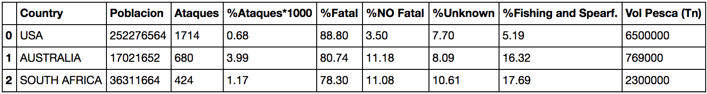

# Project 1. Data Cleaning with Pandas
Limpieza de un dataset de registros de ataques de tiburones. Hipótesis, análisis y conclusiones.
El objetivo del proyecto es limpiar un conjunto de datos desordenado que contiene los registros de ataques de tiburones. Hay que importarlo, limpiarlo y dejarlo preparado para su análisis, exportándolo a un .csv limpio.
Una vez limpio, se realiza un análisis de los datos para justificar la hipótesis y sacar conclusiones sobre la misma.

# Hipótesis
Entre los paises donde más atacan los tiburones, ¿Cuál es el menos arriesgado para practicar actividades relacionadas con la pesca?

# Limpieza de datos
- Estandarización y corrección de nombres y datos de columnas
- Eliminación de columnas duplicadas (Ej: 'Case Number.1' & 'Case Number.2')
- Eliminación de columnas nulas (Ej: 'Unnamed: 22' & 'Unnamed:23')
- Eliminación de información prescindible para el análisis
- Modificación del contenido de la columna 'Date' para convertirla en 'Month'
- Eliminación de registros incompletos o defectuosos (Ej: 'Fatal'=2017 & 'Fatal'='M')

# Análisis
- Importación de un conjunto de datos relativos a la población de los paises a analizar
- Análisis de ataques en función de la población por pais
- Análisis de ataques relacionados con las actividades de pesca en función de los ataques de la zona, la población y el volumen de pesca

# Conclusiones
El análisis se ha reducido a Estados Unidos, Australia y Sudáfrica, ya que son las zonas en las que hay mayor número de ataques de tiburones registrados. Estos registros se remontaban al año 1751, pero durante los primeros 200 años había muy pocos casos, por lo que se ha prescindido de ellos y se ha realizado el análisis teniendo en cuenta los casos desde 1960 (hasta 2018).

- Datos de la tabla:

    - Country: Diferencia las zonas con mayor número de ataques (EEUU, Australia y Sudáfrica)
    - Población: Se ha cogido como referencia la media de la población entre 1960 y 2018
    - Ataques: Número de ataques registrados
    - % Ataques*1000: Porcentaje de ataques sobre la población media (por mil)
    - % Fatal: Porcentaje de muertes por ataques
    - % NO Fatal: Porcentaje supervivientes despues de un ataque
    - % Unknown: Porcentaje unknown despues de un ataque
    - % Fishing and Spearfishing: Porcentaje de ataques relacionados con la pesca sobre el total

-  Conclusiones:
    - La población es mayor en EEUU, luego Sudáfrica y luego Australia, sin embargo la zona donde más atacan los tiburones es en Australia, seguido de Sudáfrica y terminando por EEUU
    - Teniendo en cuenta los ataques de cada zona, aún habiendo más casos en Australia, la zona donde más atacan a pescadores es en Sudáfrica
    - Volumen de pesca:
        - EEUU: 6,5 millones de toneladas - 23Kg per cápita al año
        - Australia: 769 mil toneladas - 20Kg per cápita al año
        - Sudáfrica: 2,3 millones de toneladas / 33 mil toneladas - 19Kg per cápita al año 
            (fuente: http://www.fao.org/3/w3265s/w3265s04.htm)
    - Donde más volumen de pesca existe es en EEUU, y es donde menos ataques a pescadores existen, por lo que es la zona más segura para pescar, dentro de las zonas donde atacan los tiburones. Sudáfrica es la zona donde más ataques a pescadores hay, pero teniendo en cuenta el ratio de ataques con respecto al volumen de pesca, podemos comprobar que la zona más peligrosa para realizar esta actividad es Australia.

# Recursos adicionales para el análisis
- Población
    https://datosmacro.expansion.com/demografia/poblacion/australia
    https://datosmacro.expansion.com/demografia/poblacion/sudafrica
    https://datosmacro.expansion.com/demografia/poblacion/usa
- Volumen de pesca
    http://www.fao.org/3/w3265s/w3265s04.htm)